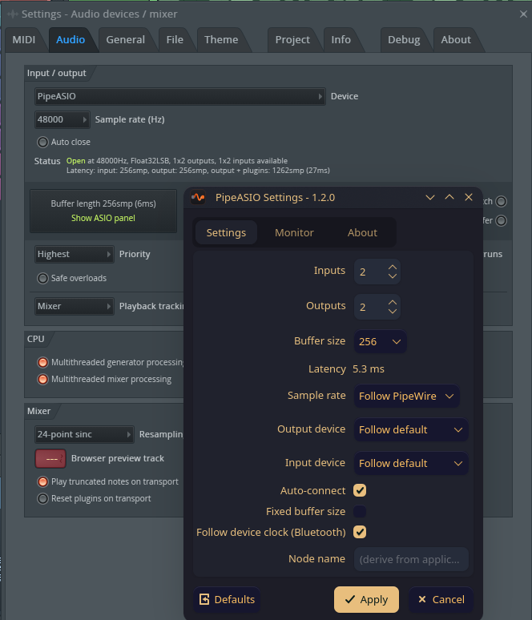

<p align="center">
  <picture>
    <source media="(prefers-color-scheme: dark)" srcset="docs/logo.svg">
    
  </picture>
</p>

<p align="center">
  <a href="https://m0n7y5.github.io/pipeasio/"><b>Website &amp; docs</b></a>
</p>

<p align="center">
  <a href="https://github.com/M0n7y5/pipeasio/releases"></a>
  <a href="https://aur.archlinux.org/packages/pipeasio"></a>
  <a href="https://fluxer.gg/HbKTgk5V"></a>
  
  
  
</p>

PipeASIO lets Windows music software running under Wine or Proton use fast,
low-latency audio on Linux.

ASIO is the standard low-latency audio driver on Windows. Music programs (DAWs)
such as FL Studio, Ableton Live, and Reaper rely on it for responsive playback
and recording. PipeASIO provides that driver inside Wine and connects it
straight to PipeWire, the audio system modern Linux distributions use. Your DAW
sees a normal ASIO device. PipeWire sees a normal audio app it can route
anywhere.

It works in plain Wine and inside Proton and Steam (Faugus, Proton-CachyOS),
and it installs safely next to WineASIO: your DAW lists them as two separate
drivers.



> [!NOTE]
> PipeASIO is at **1.6.0**. It is verified with FL Studio under Proton-CachyOS and with the [VB-Audio ASIO Test](https://forum.vb-audio.com/viewtopic.php?p=4259#p4259) utility (64-bit and 32-bit). Other ASIO hosts such as Reaper and Ableton Live should work but are not yet confirmed. x86_64, with experimental opt-in 32-bit (WoW64) support. Bug reports are very welcome on the [issue tracker](https://github.com/M0n7y5/pipeasio/issues).

## Support

If PipeASIO is useful to you, you can support its development on Ko-fi:

[](https://ko-fi.com/m0n7y5)

## Contributing

**Issues are open to everyone.** Bug reports, questions and feature requests are
welcome on the [issue tracker](https://github.com/M0n7y5/pipeasio/issues) - no
invitation needed, and a good bug report is usually worth more than a patch.

**Pull requests are only reviewed from manually selected contributors.** PipeASIO
has one maintainer, and the repository was attracting pull-request spam from
botted accounts; sifting through it was eating the time that goes into the
driver. 

If you would like to work on PipeASIO, come and say so in the Fluxer guild, with
a rough outline of what you want to change:

<a href="https://fluxer.gg/HbKTgk5V">
  <picture>
    <source media="(prefers-color-scheme: dark)" srcset="docs/fluxer-logo-white.svg">
    
  </picture>
</a>

**[Join the guild &rarr;](https://fluxer.gg/HbKTgk5V)**

Once you are on the contributor list the usual rules apply: run `clang-format`
(the config is in-tree) before submitting, and keep changes x86_64 and C11.
Pull requests from outside the list are closed without review - open an issue or
reach out in the guild instead.

## Quick start

On Arch Linux and derivatives (CachyOS, EndeavourOS, Manjaro), install
[`pipeasio` from the AUR](https://aur.archlinux.org/packages/pipeasio):

```sh
paru -S pipeasio   # or: yay -S pipeasio

# Register in the current Wine prefix
pipeasio-register
```

Everywhere else, build from source:

```sh
# Build
cmake -B build -DCMAKE_BUILD_TYPE=Release && cmake --build build

# Install (user-local, or --prefix /usr for system-wide)
cmake --install build --prefix "$HOME/.local"

# Register in the current Wine prefix
pipeasio-register
```

Under Proton or Steam, also set `WINEDLLPATH=$HOME/.local/lib/wine` in the launcher and register inside the game's prefix. See the Proton / Steam / Faugus section below.

## Building

CMake only. The driver is 64-bit. Opt-in 32-bit (WoW64) support for 32-bit
Windows hosts is covered in [32-bit applications](#32-bit-applications-experimental).

The driver is two halves, the layout Wine uses for its own modules: a PE
DLL (`pipeasio64.dll`, the COM object and ASIO surface) and a unixlib
(`pipeasio64.so`, the PipeWire client) that the PE reaches through
`__wine_unix_call`. The PE half is linked by `winegcc` exactly as Wine links
its own DLLs, against Wine's headers and import libraries, with a cross
compiler; the unixlib is built with the host compiler. Nothing in the PE
half links libpipewire, and nothing in the unixlib knows about COM.

Requirements: `cmake` (3.20 or newer), `ninja` (recommended) or GNU make,
`gcc`, `pkg-config`, the Wine SDK (headers, `winebuild`, `winegcc` and the
`lib/wine/<arch>-windows` import libraries), a cross compiler for the PE
half, and the PipeWire development headers. The cross compiler is either
the MinGW gcc for x86 targets (`mingw-w64-gcc` on Arch,
`gcc-mingw-w64-x86-64` on Debian/Ubuntu, `mingw64-gcc` on Fedora) or
`clang` with `lld`, which is what Wine itself cross-builds with and the
only choice for ARM64; `PIPEASIO_PE_COMPILER=gcc|clang` forces one. The Qt6 settings panel is optional: it builds
when a C++ compiler and Qt6 Widgets are present and is skipped with a warning
otherwise, which does not affect the driver. Pass `-DBUILD_SETTINGS_PANEL=OFF`
to skip it deliberately and silence the warning.

Package names differ per distribution. These are the sets CI builds against,
plus the Qt6 package for the optional panel:

```sh
# Arch / CachyOS / EndeavourOS / Manjaro
sudo pacman -S --needed cmake ninja gcc pkgconf wine libpipewire qt6-base

# Fedora
sudo dnf install cmake ninja-build gcc gcc-c++ pkgconf \
    wine-devel pipewire-devel qt6-qtbase-devel

# Debian / Ubuntu
sudo apt install cmake ninja-build gcc g++ pkg-config \
    wine64-tools libwine-dev libpipewire-0.3-dev qt6-base-dev
```

There is no `libpipewire-0.3-dev` or `winehq-*-dev` on Fedora, and no
`wine-devel` on Debian; installing the wrong name makes the whole transaction
fail, and the build then stops at `libpipewire-0.3 not found` or `Wine SDK
headers not found`. Those are the distributions' own packages. Wine from the
WineHQ repositories works differently (see
[Wine outside /usr](#wine-outside-usr)): Fedora's `wine-devel` is a headers
package in `/usr/include/wine`, while WineHQ's `wine-devel` is a whole Wine
branch in `/opt/wine-devel`.

```sh
cmake -B build -DCMAKE_BUILD_TYPE=Release
cmake --build build
```

### Wine outside /usr

The WineHQ packages install into `/opt/wine-{devel,stable,staging}`, and some
installer scripts drop a private Wine under `$HOME`. Put that Wine's `bin/` on
`PATH`: CMake finds `winebuild` there and takes the headers from the same
prefix, so the SDK belongs to the Wine you build against.

```sh
PATH=/opt/wine-devel/bin:$PATH cmake -B build -DCMAKE_BUILD_TYPE=Release
```

This works only if the SDK is installed in that prefix too. WineHQ splits every
branch in two: the branch package ships `bin/` (including `winebuild`), while a
separate companion ships `include/wine/`. An `/opt/wine-devel` with no
`include/` directory is the usual case:

```sh
# Fedora, WineHQ repository - match the branch you installed
sudo dnf install wine-devel-devel     # or wine-stable-devel / wine-staging-devel

# Debian / Ubuntu, WineHQ repository
sudo apt install wine-devel-dev       # or wine-stable-dev / wine-staging-dev
```

Configure warns when `winebuild` comes from a prefix whose `include/` has no
SDK and another Wine's headers are used instead.

Only if that fails, override the probe with `-DWINE_INCLUDE_DIRS` - and pass
the include *directories*, not the install root. All three matter: the root
resolves `wine/debug.h`, `wine/` holds `unixlib.h` (needed by the 32-bit WoW64
halves), and `wine/windows/` is the Win32 SDK:

```sh
cmake -B build -DCMAKE_BUILD_TYPE=Release \
    -DWINE_INCLUDE_DIRS="/opt/wine-devel/include;/opt/wine-devel/include/wine;/opt/wine-devel/include/wine/windows"
```

Debian's `libwine-dev` nests one level deeper (`/usr/include/wine`,
`/usr/include/wine/wine`, `/usr/include/wine/wine/windows`). Configure checks
the list before compiling and names whichever header it cannot reach.

Debug build (assertions and Wine debug-channel macros):

```sh
cmake -B build-debug -DCMAKE_BUILD_TYPE=Debug
cmake --build build-debug
```

## Installing

### From the AUR (Arch Linux)

```sh
paru -S pipeasio
```

The package installs the driver system-wide under `/usr`, plus the
`pipeasio-settings` panel with a desktop entry and icon. Note that a
system-wide install is invisible to Proton's container. See the Proton /
Steam / Faugus section below.

### From a GitHub release

[Releases](https://github.com/M0n7y5/pipeasio/releases) carry a prebuilt
`pipeasio-<version>-archlinux-x86_64.tar.gz` (the 64-bit driver plus the opt-in
32-bit WoW64 front end) for the Arch / CachyOS family. Extract it over a prefix:

```sh
# user-local (required for Proton / Faugus / Steam, see below)
tar -xzf pipeasio-*-archlinux-x86_64.tar.gz -C "$HOME/.local"
# or system-wide
sudo tar -xzf pipeasio-*-archlinux-x86_64.tar.gz -C /usr
```

then [register](#registering). The download is *scoped*: its `BUILD-INFO.txt`
lists the exact Wine, glibc, and PipeWire it was built against. A different Wine
version or an older glibc can fail to load (`regsvr32` `c0000135`). Build it
[from source](#from-source) in that case.

### From source

System-wide:

```sh
sudo cmake --install build --prefix /usr
```

That puts the driver under `/usr/lib/wine`, which is where distro Wine reads
it on Arch and similar layouts. Elsewhere Wine's library dir differs:
`/usr/lib64/wine` on Fedora, `/usr/lib/x86_64-linux-gnu/wine` on
Debian/Ubuntu, and `lib/wine` inside the tree for WineHQ builds under
`/opt/wine-<branch>`. For those, point the driver files at the right root (the
tools still land under the normal prefix):

```sh
# Fedora
cmake -B build -DPIPEASIO_WINE_INSTALL_ROOT=/usr/lib64/wine
sudo cmake --install build --prefix /usr

# Debian/Ubuntu
cmake -B build -DPIPEASIO_WINE_INSTALL_ROOT=/usr/lib/x86_64-linux-gnu/wine
sudo cmake --install build --prefix /usr

# WineHQ (e.g. wine-staging)
cmake -B build -DPIPEASIO_WINE_INSTALL_ROOT=/opt/wine-staging/lib/wine
sudo cmake --install build --prefix /usr
```

User-local (no `sudo`, under `$HOME`, required for Proton / Faugus / Steam, see
below):

```sh
cmake --install build --prefix "$HOME/.local"
```

Either one lays down:

```
<prefix>/lib/wine/x86_64-windows/pipeasio64.dll   (PE front end)
<prefix>/lib/wine/x86_64-unix/pipeasio64.so       (unixlib)
```

Upgrading from 1.6.0 or older: those installs staged a 2 KB PE stub into
every registered prefix's `system32`, and the new layout has no `.dll.so`
for that stub to find. Run `pipeasio-register` again in each prefix; it
replaces the stub with the real PE.

By default the driver installs under `<prefix>/lib/wine`, matching Wine's
upstream layout (`CMAKE_INSTALL_LIBDIR` does not move it);
`PIPEASIO_WINE_INSTALL_ROOT` overrides that root with an absolute path. Where
the driver *should* go depends on your Wine; see [Registering](#registering)
for why it matters at runtime.

## Registering

After installing, register the driver in each Wine prefix. A helper script is
provided:

```sh
pipeasio-register
```

This activates PipeASIO for the current Wine prefix (the default is `~/.wine`).
To target another prefix:

```sh
env WINEPREFIX="$HOME/asioapp" pipeasio-register
```

`pipeasio-register` searches for the install root in this order:
`$PIPEASIO_PREFIX/lib/wine`, then `$HOME/.local/lib/wine`, then
`/usr/local/lib/wine`, then `/usr/lib/wine`, then distro variants, then
`/opt/wine-{devel,stable,staging}/lib{,64}/wine`. Set `PIPEASIO_PREFIX` to
point it at a non-standard install, or `PIPEASIO_REGISTER_CANDIDATES` to
replace the built-in list entirely (colon-separated; `PIPEASIO_PREFIX` is
still searched first).

Registration only makes the driver *visible* to a prefix. At launch, Wine
resolves the driver's Unix half only in its own library dir and in
`WINEDLLPATH`, so the install root must be that library dir: `/usr/lib/wine`
on Arch/Fedora layouts, `/usr/lib/x86_64-linux-gnu/wine` on Debian/Ubuntu, or
the `lib/wine` inside a WineHQ `/opt/wine-<branch>` tree.
`pipeasio-register` compares the install root against the `wine` on your
`PATH` and warns when they mismatch. The fix is to install into the matching
root (`-DPIPEASIO_WINE_INSTALL_ROOT=...`, see [Installing](#installing)) or to
set `WINEDLLPATH=<driver-install-root>` in the host's launch environment.

The script runs whatever `wine` is on `PATH`; `WINE=<command>` substitutes
another launcher, `umu-run` included. Proton prefixes (anything with a
`tracked_files`) and Bottles bottles (anything with a `bottle.yml`) are refused
unless `WINE` is set, see [Proton / Steam / Faugus](#proton--steam--faugus) and
[Bottles](#bottles).

## 32-bit applications (experimental)

PipeASIO is 64-bit by default. A front end for **32-bit** Windows ASIO hosts
(foobar2000 `foo_out_asio`, older REAPER builds, ...) can be built opt-in via
Wine's *new WoW64*: it is the same PE front end compiled for i386, over a
unixlib built from the same sources as the 64-bit one. There is no 32-bit
libpipewire and no 32-bit Linux userspace - only the Windows-facing half is
i386.

> **Experimental, off by default.** The 64-bit driver is byte-for-byte
> unaffected. The 32-bit path is validated end-to-end by the `asio_probe32`
> host and by VB-Audio's VBASIOTest32 (a real i386 ASIO host): COM
> `Init -> CreateBuffers -> Start`, real-time streaming, autoconnect to the
> selected hardware, and live config reload all work. Bit-exact loopback
> validation on 32-bit is still pending.

It needs the i686 MinGW cross-compiler on top of the normal build
requirements (`mingw-w64-gcc` on Arch covers both; Debian/Ubuntu split it):

```sh
sudo apt install gcc-mingw-w64-i686   # Debian / Ubuntu
```

Configure with `-DBUILD_WOW64_32=ON` (default OFF). Set `WINE_LIB_ROOT` if your
Wine library prefix is not `/usr/lib/wine`:

```sh
cmake -B build -DCMAKE_BUILD_TYPE=Release -DBUILD_WOW64_32=ON
cmake --build build
```

Installing then lays the 32-bit halves alongside the 64-bit ones:

```
<prefix>/lib/wine/i386-windows/pipeasio32.dll    (PE front end)
<prefix>/lib/wine/x86_64-unix/pipeasio32.so      (unixlib, 64-bit ELF)
```

`pipeasio-register` handles both architectures automatically: it registers the
CLSID under the 64-bit registry view and, when `pipeasio32.dll` is present, the
same CLSID under the 32-bit view (`regsvr32 /reg:32`). 32-bit and 64-bit hosts
can then use PipeASIO from the same prefix.

Under Proton, 32-bit apps additionally need `PROTON_USE_WOW64=1` (or Faugus's
WoW64 toggle) so Proton runs them through new WoW64 - see
[Proton / Steam / Faugus](#proton--steam--faugus).

## Proton / Steam / Faugus

Proton runs Wine inside a pressure-vessel container (steamrt4). The container does
not expose the host's `/usr/lib/wine/`, so a system-wide install is invisible to
Proton's Wine. Two things make PipeASIO work inside Proton (32-bit apps need a
third, see step 3):

1. Install PipeASIO under `$HOME` (pressure-vessel exposes the home directory by
   default):

   ```sh
   cmake --install build --prefix "$HOME/.local"
   ```

2. Set `WINEDLLPATH=$HOME/.local/lib/wine` in the launcher's per-game environment
   so Proton's Wine finds the ELF `.so` half. Proton has honored a host-provided
   `WINEDLLPATH` since
   [PR #9420](https://github.com/ValveSoftware/Proton/pull/9420), and
   Proton-CachyOS ships this fix.

   - **Steam:** put it in the game's launch options (right-click the game >
     Properties > General):

     ```
     WINEDLLPATH=/home/<you>/.local/lib/wine %command%
     ```

   - **Faugus:** put it in the per-game "Launch options" environment field:

     ```
     WINEDLLPATH=/home/<you>/.local/lib/wine
     ```

   Use the absolute path. Faugus does not expand `~` or `$HOME` in that field.

3. **32-bit games and hosts only:** enable Proton's *new WoW64* mode, which the
   32-bit front end requires (see
   [32-bit applications](#32-bit-applications-experimental)). By default Proton
   runs 32-bit apps through the classic split-WoW64 Wine libraries, which
   cannot load PipeASIO's 32-bit half.

   - **Steam:** add `PROTON_USE_WOW64=1` alongside `WINEDLLPATH` in the game's
     launch options:

     ```
     PROTON_USE_WOW64=1 WINEDLLPATH=/home/<you>/.local/lib/wine %command%
     ```

   - **Faugus:** enable the **WoW64** option in the game's settings, or add
     `PROTON_USE_WOW64=1` to the same per-game "Launch options" environment
     field as `WINEDLLPATH`.

   64-bit games and hosts do not need this.

Then register PipeASIO in the Proton wineprefix **through the runner**, not
through the host's `wine`: `umu-run` runs a Windows executable inside the same
runner and container the game uses, and `pipeasio-register` runs whatever
`WINE` names in place of `wine`:

```sh
env WINEPREFIX="$HOME/Faugus/<game>" \
    WINE=umu-run \
    PROTONPATH="$HOME/.local/share/Steam/compatibilitytools.d/<runner>" \
    GAMEID=umu-<game> \
    pipeasio-register
```

`PROTONPATH` is the full path of the runner directory the game is configured
with, under `~/.local/share/Steam/compatibilitytools.d/` or
`/usr/share/steam/compatibilitytools.d/`; a bare name only resolves for runners
in the user directory. `GAMEID` is any stable label; without one umu falls back
to `umu-default`. Faugus bundles `umu-run` at
`~/.local/share/faugus-launcher/umu-run` if the `umu-launcher` package is not
installed. For a Steam game the prefix is
`~/.steam/steam/steamapps/compatdata/<appid>/pfx`. The PE stub lands in
`<prefix>/drive_c/windows/system32/` and the CLSID registration persists in
the prefix registry, both shared across Wine versions.

`pipeasio-register` refuses a Proton prefix when `WINE` is unset. Host Wine is
a different build from the runner's, and the first host-Wine process in a
prefix runs Wine's prefix update, rewriting the registry and `system32` for the
host build ([#22](https://github.com/M0n7y5/pipeasio/issues/22)). Unregistering
uses the same environment, see [Uninstalling](#uninstalling).

## Bottles

Bottles runs each bottle with its own downloaded runner (Soda, Caffe, a GE
build), never the host's Wine, and the Flatpak build runs it inside a sandbox
that sees neither `/usr/lib/wine` nor `$HOME/.local/lib/wine`. The driver
stays where `cmake --install` put it; the bottle gets the PE stub and a
`WINEDLLPATH` pointing at the ELF half, and registration runs through Bottles'
own launcher so the bottle's runner is the Wine that registers it. Verified
with the Flatpak (`com.usebottles.bottles` 67.2, Soda 11.0) against a driver
installed under `$HOME/.local`:

```sh
# Once: let the sandbox read the driver and reach PipeWire at run time.
flatpak override --user --filesystem="$HOME/.local/lib/wine:ro" com.usebottles.bottles
flatpak override --user --filesystem=xdg-run/pipewire-0 com.usebottles.bottles

BOTTLE="$HOME/.var/app/com.usebottles.bottles/data/bottles/bottles/<name>"
CLI="flatpak run --command=bottles-cli com.usebottles.bottles"

# The PE stub goes where regsvr32 finds it by name; the ELF half is reached
# through WINEDLLPATH in the bottle's environment.
cp "$HOME/.local/lib/wine/x86_64-windows/pipeasio64.dll" "$BOTTLE/drive_c/windows/system32/"
$CLI edit -b <name> --env-var "WINEDLLPATH=$HOME/.local/lib/wine"
$CLI shell -b <name> -i "regsvr32 /s pipeasio64.dll"
$CLI shell -b <name> -i "reg query HKLM\\Software\\ASIO\\PipeASIO"

# 32-bit hosts, if the install carries the 32-bit half:
cp "$HOME/.local/lib/wine/i386-windows/pipeasio32.dll" "$BOTTLE/drive_c/windows/syswow64/"
$CLI shell -b <name> -i "C:\\windows\\syswow64\\regsvr32.exe /s pipeasio32.dll"
```

`<name>` is the bottle's directory name under `data/bottles/bottles/`; `shell`
needs the backslashes doubled as shown. The PipeWire override is what the
driver needs at run time, not for registering: without it the sandbox holds an
empty file at the socket's path. Native Bottles (the distribution package)
keeps its data under `~/.local/share/bottles/` and runs the same `bottles-cli`
directly, with no `flatpak override` lines. Copying the driver into the
runner's own `lib/wine/` works as well but a runner update wipes it.

`pipeasio-register` refuses a bottle (anything with a `bottle.yml`) when `WINE`
is unset, for the reason given for Proton above: host Wine in a bottle
re-stamps it for the host build, and the next Bottles launch stamps it back,
so the two keep migrating the prefix between builds. For native Bottles
`WINE=~/.local/share/bottles/runners/<runner>/bin/wine` makes the script
register through the runner instead.

## ARM64

ARM64 Linux runs Windows audio hosts two ways, and the driver builds a PE
front end for each: `aarch64-windows/pipeasio64.dll` for native ARM64
Windows hosts (FL Studio 24.1+ has one), and `arm64ec-windows/pipeasio64.dll`
for x86_64 hosts running under Wine with FEX (Ableton, older FL Studio,
most of what exists). Both share the one aarch64 unixlib. Wine loads only
this split layout on ARM64, which is why the driver moved to it
([#23](https://github.com/M0n7y5/pipeasio/issues/23)).

Building needs `clang` and `lld` (there is no MinGW gcc for these targets)
and a Wine that was itself built for `aarch64` and `arm64ec`, so that
`lib/wine/aarch64-windows/` and `lib/wine/arm64ec-windows/` carry the import
libraries; Fedora's Wine does, and it is what Asahi Linux ships. `BUILD_ARM64`
(default on) builds each front end whose toolchain and import libraries are
present and reports the ones it skips. On an x86_64 host only the PE halves
can be cross-built; the unixlib is always the host's.

Status: the front ends build and register (CI does that on an ARM64 runner),
but nobody has yet run an audio host through them on real hardware. Reports
from an Asahi or other ARM64 machine are what moves this from "builds" to
"works", on the tracking issue above.

## Other distributions

Active support targets Arch Linux and its derivatives (CachyOS, EndeavourOS,
Manjaro), but PipeASIO itself is distribution-agnostic: it is plain
`libpipewire-0.3` plus Wine, with no distro-specific code paths, so it runs
wherever those are available. A few environment details differ between distros
and are the usual causes of trouble elsewhere:

- **Wine library layout.** Both DLL halves must land under the distro's
  `lib/wine/x86_64-{windows,unix}/` directory: `/usr/lib/wine` on Arch,
  `/usr/lib/x86_64-linux-gnu/wine` on Debian/Ubuntu, `/usr/lib64/wine` on
  Fedora. Match it with `-DPIPEASIO_WINE_INSTALL_ROOT=...` at configure time
  (see [Installing](#installing)); `WINE_LIB_ROOT` only locates the 32-bit
  import libraries at build time and does not affect install locations. A
  user-local `--prefix "$HOME/.local"` install plus `WINEDLLPATH` sidesteps
  the question entirely.
- **Wine version.** The 64-bit driver runs on current Wine. The experimental
  32-bit front end additionally requires Wine's *new WoW64*. Older or
  split-WoW64 Wine cannot load it.
- **PipeWire version.** 1.4.2 or newer, the version Steam Runtime 4 and Debian
  13 ship; configure refuses anything older. The forced quantum/rate that pins
  low latency is not what sets this floor - those properties have existed since
  PipeWire 0.3.45. What does raise latency is the daemon clamping the forced
  quantum to `clock.min-quantum` / `clock.max-quantum`, at any version; the
  driver logs a warning naming both when that happens.
- **Real-time priority.** The driver runs at normal scheduling by default;
  `SCHED_FIFO` priority 15 is opt-in. See [Performance](#performance) for
  access requirements.

## Configuration

PipeASIO talks to PipeWire 1.4.2+ natively through `libpipewire-0.3`. The graph
quantum is locked to the ASIO host's negotiated buffer size with
`PW_KEY_NODE_FORCE_QUANTUM` (unless `follow_device_clock` is set, in which case the
target device drives the cycle). The sample rate follows the graph unless pinned
with `sample_rate`, in which case `PW_KEY_NODE_FORCE_RATE` is set.

Settings live in a flat INI file at `$XDG_CONFIG_HOME/pipeasio/config.ini`
(fallback `~/.config/pipeasio/config.ini`). The driver reads it at startup and
re-reads it while running, so saving in the settings panel applies within about a
second without reselecting the driver or restarting the host. Every option can
also be overridden by an environment variable. A missing file means built-in
defaults, and unknown keys are ignored. The file has a single `[pipeasio]`
section.

### inputs / outputs
Number of PipeWire DSP ports PipeASIO opens. Default 2 / 2.
Env: `PIPEASIO_NUMBER_INPUTS`, `PIPEASIO_NUMBER_OUTPUTS`.

### auto_connect
Default 1: connect the channels to a hardware device on start. Set to 0 to leave
the node unconnected and patch it yourself in a PipeWire patchbay.
Env: `PIPEASIO_CONNECT_TO_HARDWARE` (`on`/`off`).

### output_device / input_device
The PipeWire `node.name` of the sink (output) and source (input) to auto-connect
to. Empty (the default) follows the PipeWire default sink/source, re-resolved each
time the driver reconnects.
Env: `PIPEASIO_OUTPUT_DEVICE`, `PIPEASIO_INPUT_DEVICE`.

### sample_rate
`0` (default) follows the PipeWire graph rate, and lets the ASIO host choose one:
`CanSampleRate()` then offers 44100, 48000, 88200, 96000, 176400 and 192000, and
`SetSampleRate()` pins the graph to the host's choice with
`PW_KEY_NODE_FORCE_RATE` on the next activation. A non-zero value pins the rate
here instead and the host can no longer change it, the same way
`fixed_buffer_size` takes the buffer size away from the host. Hosts that demand a
specific rate need this left at 0; Rocksmith through RS_ASIO requires 48 kHz.
Env: `PIPEASIO_SAMPLE_RATE`.

### fixed_buffer_size
Default 1: the buffer size is controlled by PipeWire and the ASIO host cannot
change it. Set to 0 to let the host change PipeWire's quantum (via
`PW_KEY_NODE_FORCE_QUANTUM`) in `CreateBuffers()`.
Env: `PIPEASIO_FIXED_BUFFERSIZE` (`on`/`off`).

### follow_device_clock
Default 0 (off): the driver pins the PipeWire graph quantum to the host's buffer
size, runs as its own low-latency clock master, and is scheduled synchronously.
Set to 1 and two properties change together. The driver drops `FORCE_QUANTUM`,
so the target device drives the cycle and dictates the buffer size (the driver
settles to the device's quantum after one automatic reset), and the node turns
asynchronous (`PW_KEY_NODE_ASYNC`), which `pw-top` marks `=` instead of `+`.
Asynchronous costs one more buffer period of round trip and in exchange absorbs
a callback that overruns instead of stalling the graph. The settings panel's
read-only `Scheduling` row names the resulting mode and that extra period.

Reach for it when a Bluetooth sink is silent or drifts: its clock is the radio
link and cannot always be slaved to the host, and PipeWire then drops the links.
Not every Bluetooth sink needs it; some accept a forced quantum and run
synchronously.
Env: `PIPEASIO_FOLLOW_DEVICE_CLOCK` (`on`/`off`).

### buffer_size
The preferred size returned by `GetBufferSize()`. Must be a power of two within
[32, 8192]. Out-of-range values fall back to 1024. The floor is 32 rather than 16
because hosts mishandle smaller ASIO buffers (Max/MSP crashes on them), and
RS_ASIO rounds every request up to a multiple of 32 regardless.
Env: `PIPEASIO_PREFERRED_BUFFERSIZE`.

A size the hardware does not support makes PipeWire reject the request or insert
resampling, and either way you may get xruns.

### node_name
Overrides the PipeWire client/node name (otherwise derived from the host program
name).
Env: `PIPEASIO_CLIENT_NAME`.

### realtime
Default 0 (off), experimental. When enabled, the thread carrying the host's
`bufferSwitch` callback uses `SCHED_FIFO` priority 15, covering both the native
PipeWire data loop and the WoW64 PE pump.

Only that one thread is elevated. A host that dispatches DSP work from the
callback to its own worker threads leaves those workers at `SCHED_OTHER`, and
the resulting priority asymmetry can make things much worse: measured on FL
Studio 2025 under Wine at 64 frames / 48 kHz, enabling this produced roughly 39x
more xruns on the PipeASIO node than leaving it off.

In FL Studio, also turn **Mix in buffer switch** off (Options > Audio settings >
Input / output) before enabling this. That option makes FL Studio run its mixing
and plugin processing inside the ASIO `bufferSwitch` callback, which the driver
delivers on the PipeWire data loop. With
[`follow_device_clock`](#follow_device_clock) off the driver is scheduled
synchronously (see [Performance](#performance)), so the callback has one buffer
period to return and a full mixer pass does not fit: the graph stalls instead of
absorbing the overrun. With **Mix in buffer switch** off, FL Studio mixes on its
own threads and the callback only hands over buffers that are already filled.

Useful as a diagnostic for the scheduling-related xruns in
[#4](https://github.com/M0n7y5/pipeasio/issues/4), not as a fix for them. It
takes effect the next time the host starts the driver.

Env: `PIPEASIO_RT_PRIORITY` (`off`/`on`). The environment overrides the file.

## Performance

A few knobs affect xrun-free, low-latency operation:

- Real-time scheduling. The callback thread runs at normal scheduling by
  default; `SCHED_FIFO` is opt-in via [`realtime`](#realtime), and on
  multi-threaded hosts it often costs more xruns than it saves. When you do opt
  in, the requested priority is 15 (the previous native/WoW64 defaults were
  77/80). It must stay below the PipeWire daemon's data loop: RTKit caps that
  loop at 20 on stock desktops, while PAM/realtime-group setups may run it
  higher, where either value is below the daemon. On other distributions you
  usually set real-time access up yourself; the driver does not use RTKit.
  Without the grant the thread stays at normal scheduling. Verify with
  `ulimit -r` (at least 15; use a higher limit only if you pin `loop.rt-prio`).
- Channel count. Every input and output is a PipeWire port the graph must
  schedule. Defaults are 2 in / 2 out. Raise `inputs` / `outputs` only to what you
  route. Fewer ports mean a smaller graph and less overhead.
- Buffer size. Smaller buffers cut latency but raise CPU and xrun risk.
- Graph scheduling. The driver runs synchronously in the graph, so the round
  trip is one buffer period instead of two. The trade is that a callback which
  overruns stalls the graph instead of being absorbed, so pick a buffer size
  the host can meet. [`follow_device_clock`](#follow_device_clock) schedules
  asynchronously instead, which adds a buffer period and absorbs the overrun;
  `pw-top` marks the node `=` when it is asynchronous and `+` when it is not.
- Host-side callback work. Whatever the host does inside `bufferSwitch` runs
  inside the driver's cycle and counts against that same deadline. Hosts that
  offer to mix there - FL Studio's **Mix in buffer switch** - should have it
  turned off, so the callback only exchanges buffers a host thread has already
  prepared.
- Reported latency. `GetLatencies()` returns one buffer period plus whatever the
  connected device chain reports through PipeWire, so a host's delay compensation
  lines up with the real hardware instead of assuming the buffer is the only
  delay. Measured on a wired card at 1024/48000 the figure is 2080 in and 2048
  out; a USB or Bluetooth chain declares more. The driver relays
  `kAsioLatenciesChanged` when it moves, so a host can re-read it without a full
  reset.
- Xruns. When the graph runs a cycle the driver was too slow for, it logs
  `xrun: missed the cycle deadline` with a running count for the activation (the
  first, then every 64th, so a storm cannot flood the log). That is the driver's
  own accounting; the settings panel's counter is PipeWire's per-node figure,
  read from the graph's Profiler interface (the same source `pw-top` uses), which
  covers the whole graph.
- Debug logging. `PIPEASIO_DEBUG=1` makes the driver log on the audio path. Leave
  it off for normal use.

## Settings panel

The native settings panel (`pipeasio-settings`, C++/Qt6 Widgets) is built from the
`gui` subdirectory and installed to `bin`, together with a desktop entry and icon,
so it also appears in the application menu as **PipeASIO Settings**. It is built
only when Qt6 Widgets is found at configure time - otherwise configure warns,
the driver still builds, and no panel binary is produced. It runs on
your Linux host. The in-app ASIO control-panel button shows a message pointing
here, because the Qt panel cannot run inside the Wine/Proton container the host
loads the driver into.

The **Monitor** tab is a native PipeWire client: it binds the graph's Profiler
interface and is pushed one timing point per audio cycle, the same source
`pw-top` reads, so quantum, rate, xruns and DSP load match the CLI. That
interface comes from PipeWire's `module-profiler`, which stock configurations
load; if yours does not, the tab says `no Profiler interface (load PipeWire's
module-profiler)` instead of showing telemetry. The connection is held only
while the Monitor tab is showing, so the panel holds none of it while parked on
another tab. The device combos on the **Settings** tab enumerate through
`pw-dump`.

## Troubleshooting

**Configure fails with `libpipewire-0.3 not found` or `Wine SDK headers not found`.** The development packages are missing or named differently on your distribution - see [Building](#building) for the per-distro sets. Fedora has `pipewire-devel` and `wine-devel`, not `libpipewire-0.3-dev` or `winehq-*-dev`.

**Configure fails with `Package 'libpipewire-0.3' has version 'X', required version is '>= 1.4.2'`.** Your distribution's PipeWire predates the minimum. Ubuntu 24.04 LTS (1.0.5) is the case that actually hits people; Ubuntu 25.10 (1.4.7), Ubuntu 26.04 LTS (1.6.2), Debian 13 (1.4.2), Fedora 43 (1.4.8), Fedora 44 (1.6.2) and Arch are all above the floor. There is no workaround in the driver: `src/audio.c` uses `spa_json_str_object_find()`, added in PipeWire 1.4.0, so an older PipeWire could never build - it only used to fail later with `implicit declaration of function`. Upgrade the distribution, or build PipeWire 1.4.2+ yourself and point `PKG_CONFIG_PATH` at it. The build then links that copy by absolute path rather than by `-l` name, so it cannot silently fall back to the system library - but the runtime loader still has to find it, via `LD_LIBRARY_PATH` or an `ldconfig` entry.

**Build fails with `wine/debug.h` or `unixlib.h`: `No such file or directory`.** Configure picked an SDK that does not hold the headers. For Wine outside `/usr`, install its SDK companion (`wine-devel-devel` on Fedora, `wine-devel-dev` on Debian/Ubuntu, matching your branch) and put that prefix's `bin/` on `PATH`. A manual `-DWINE_INCLUDE_DIRS` must list the include directories, not the install root, and needs all three: `/opt/wine-devel/include;/opt/wine-devel/include/wine;/opt/wine-devel/include/wine/windows`. The `wine/` one carries `unixlib.h`, used only by the 32-bit WoW64 build.

**`... holds no Wine SDK, so ... is used instead`.** `winebuild` came from a private prefix with no headers beside it, so another Wine's SDK was used. Install the matching `-devel`/`-dev` companion package, or the driver is compiled against a different Wine version than it runs on.

**`Qt6 Widgets not found - skipping the settings panel`.** The driver still builds, but `pipeasio-settings` does not, so there is no panel to open. Install Qt6 Widgets (`qt6-base` on Arch, `qt6-qtbase-devel` on Fedora, `qt6-base-dev` on Debian/Ubuntu), then re-run configure, rebuild and re-install. Run it from a host terminal or the **PipeASIO Settings** menu entry; your DAW's ASIO control-panel button never opens it, with or without Qt, and only shows a message pointing here. Pass `-DBUILD_SETTINGS_PANEL=OFF` if you want no panel.

**No sound, or the driver does not load under Proton.** Proton's container cannot see `/usr/lib/wine`. Install under `$HOME` and set `WINEDLLPATH` in the game's launch options (Steam: `WINEDLLPATH=/home/<you>/.local/lib/wine %command%`; Faugus: the same variable in the per-game environment field), then register in that prefix.

**A 32-bit game or host does not list PipeASIO under Proton.** Proton runs 32-bit apps through classic split WoW64 by default, which cannot load the 32-bit front end. In Steam, add `PROTON_USE_WOW64=1` alongside `WINEDLLPATH` in the game's launch options (`PROTON_USE_WOW64=1 WINEDLLPATH=/home/<you>/.local/lib/wine %command%`). In Faugus, enable the WoW64 option in the game's settings. The install must also include the 32-bit half (`-DBUILD_WOW64_32=ON`).

**Registering fails with status `c0000135`.** Wine loaded the PE half but could not load its unixlib (`pipeasio64.so`). Either Wine is not looking where it is installed (set `WINEDLLPATH` to the install's `lib/wine`, or install into Wine's own library dir, see [Registering](#registering)), or the unixlib was built against a different Wine or glibc than the one running (a prebuilt tarball on the wrong host; rebuild from source). An install from 1.6.0 or older that was never re-registered fails the same way, since the stub it left in `system32` looks for a `.dll.so` that no longer exists: run `pipeasio-register` again.

**Bluetooth headphones produce no sound.** Turn on `follow_device_clock` (or set `PIPEASIO_FOLLOW_DEVICE_CLOCK=on`). A Bluetooth sink's clock is the radio link and cannot always be slaved to the host, so the driver follows it instead. Some Bluetooth sinks do accept a forced quantum and work with the option off, which keeps the synchronous scheduling and its lower latency, so try it both ways.

**FL Studio crackles or xruns constantly, especially with [`realtime`](#realtime) enabled.** Turn **Mix in buffer switch** off in Options > Audio settings > Input / output. It makes FL Studio mix and run plugins inside the ASIO callback, which the driver delivers on the PipeWire data loop with one buffer period to return; a full mixer pass overruns that, and with [`follow_device_clock`](#follow_device_clock) off the driver is scheduled synchronously, so the overrun stalls the graph rather than being absorbed. With it off, FL Studio mixes on its own threads and the callback only hands over ready buffers.

**Does it conflict with WineASIO?** No. PipeASIO has its own CLSID and registry identity, so it installs side by side with WineASIO and hosts list them as separate drivers.

**How do I select it in my DAW?** After registering, pick PipeASIO from the host's ASIO device list. In FL Studio that is Options > Audio settings > Device.

**Where is it in my volume mixer?** The driver's node is a playback stream
(`media.class = Stream/Output/Audio`), so it appears under the host's name in
pavucontrol, plasma-pa, pulsemixer and `wpctl status`, with a volume slider and
mute like any application. The slider scales what the host plays, per output
channel, inside the driver; the host's inputs are not affected. WirePlumber
remembers the level per host the way it does for every stream, so a level you
set for FL Studio comes back the next time FL Studio starts the driver. The
node is not auto-routed by WirePlumber (it carries no `node.autoconnect`);
[`auto_connect`](#auto_connect) and the device settings still decide where it
links.

## Uninstalling

Unregister from each Wine prefix you registered, then remove the files:

```sh
# Unregister (set WINEDLLPATH the same way pipeasio-register does)
env WINEDLLPATH="$HOME/.local/lib/wine" wine regsvr32 /u pipeasio64.dll
# Proton prefix: same, through the runner, never host wine
env WINEDLLPATH="$HOME/.local/lib/wine" PROTONPATH=<runner dir> GAMEID=umu-<game> \
    umu-run regsvr32 /u pipeasio64.dll
rm -f "$WINEPREFIX/drive_c/windows/system32/pipeasio64.dll"

# Remove the installed files (CMake records them at install time)
xargs rm -f < build/install_manifest.txt
```

## Development

Recommended VS Code extensions are listed in `.vscode/extensions.json`. The build
emits `build/compile_commands.json` for clangd. The in-tree `.clang-format` and
`.editorconfig` keep diffs clean.

### Technical background

PipeASIO is a fork of [WineASIO](https://github.com/wineasio/wineasio) that
talks to PipeWire directly through `libpipewire-0.3`, with no `libjack.so.0`
runtime dependency. The fork exists because the Steam Runtime `steamrt4`
container that Proton uses ships `libpipewire-0.3` but not `libjack.so.0`,
which makes upstream WineASIO crash on `dlopen`.

The driver has its own COM identity: CLSID
`{2D3CA9E2-1193-4C5D-B5FD-38798F3DC074}`, ASIO registration under
`HKCU\Software\ASIO\PipeASIO`, and DLL filename `pipeasio64.dll`. That is why
it coexists with WineASIO: neither overrides the other.

It is built the way Wine builds its own modules: a PE half (`src/asio.c`,
`src/main.c`, `src/regsvr.c`, `src/unixlib/audio_proxy.c`, cross-compiled with
MinGW) and a unixlib (`src/audio.c`, `src/unixlib/audio_unix.c`, host gcc)
that talk over the call table in `include/pipeasio_unix_abi.h`. The ABI is
handles and fixed-width integers, never pointers, so one unixlib serves both
the x86_64 and the i386 front end. The PipeWire data loop runs in the
unixlib; a PE-side pump thread blocks in `PAU_WAIT_CALLBACK`, is woken once
per cycle, and carries the host's `bufferSwitch`. Measured against the older
single-ELF build at 128 frames, the handoff costs no round-trip latency and
no xruns. The split is also what aarch64 and arm64ec Wine require.

### Testing

`ctest --test-dir build` runs the Linux-native unit and contract tests plus the
Wine integration tests below (they SKIP without wine, `pw-cli`, a running
PipeWire daemon, and an installed driver). The two Wine-based tools can also be
run directly against a live PipeWire session:

```sh
./build/tests/asio_probe/run.sh        # COM lifecycle + bufferSwitch cycle rate
./build/tests/asio_loopback/run.sh     # digital loopback analyzer
SWEEP=1 ./build/tests/asio_loopback/run.sh   # buffer-size x sample-rate matrix
```

The loopback analyzer plays a per-channel frame counter out of the driver's
output ports and verifies it on the input ports after a PipeWire null-sink
loopback. Because PipeASIO is float32 end-to-end, the round trip must be
**bit-exact**. The tool fails on any corrupted sample, dropped or duplicated
buffer, swapped channel, or a measured round-trip latency that disagrees with
`GetLatencies()` by more than one buffer. `SWEEP=1` repeats this across buffer
sizes 128-1024 and forced sample rates 44.1/48/96 kHz, re-negotiating buffers
in-process the same way a DAW does when you change the buffer size.

When built with `-DBUILD_WOW64_32=ON`, a 32-bit analogue of the probe exercises
the full COM + real-time round trip on a 32-bit (WoW64) host:

```sh
./build/tests/asio_probe/run32.sh      # 32-bit WoW64 driver (needs MinGW + a 32-bit prefix)
```

Cross-distro builds (needs [distrobox](https://distrobox.it/) plus podman or
docker) exercise the same Release configure against each distro's injected
package-build flags - the path that broke on Fedora's `-flto=auto` before
`#6` was fixed:

```sh
./tests/distro/run.sh                  # fedora + ubuntu + arch
DISTROS="fedora ubuntu" ./tests/distro/run.sh
FRESH=1 ./tests/distro/run.sh          # recreate containers first
./tests/distro/run.sh --clean          # remove harness containers
```

The script SKIPs (exit 77) when distrobox or a container backend is missing.
CI runs the Fedora and Ubuntu legs on every push/PR via the `build-distros`
matrix job.

If you package PipeASIO, consider installing the `pipeasio-register` helper script
as part of the package.

## Acknowledgements

PipeASIO builds on [WineASIO](https://github.com/wineasio/wineasio) and the work of its authors: Robert Reif, Ralf Beck, Johnny Petrantoni, Stephane Letz, William Steidtmann, Peter L Jones, Torben Hohn, Nedko Arnaudov, Christian Schoenebeck, Joakim Hernberg, and Filipe Coelho.

## License

PipeASIO is licensed under the GNU General Public License, version 3 or later
(`GPL-3.0-or-later`). See [`COPYING`](COPYING). It is a fork of WineASIO and
retains the original authors' copyright notices, and every source file carries
an `SPDX-License-Identifier` tag.

## Changelog

See [`CHANGELOG.md`](CHANGELOG.md).
